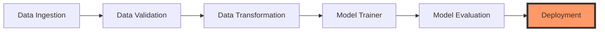

<div align="center">

# 🍷 Wine Quality Prediction AI


[](https://python.org)
[](https://flask.palletsprojects.com/)
[](https://www.docker.com/)
[](https://huggingface.co/spaces/YashAI07/Wine-quality-Prediction)

<br>

## 🚀 [**LIVE DEMO: TRY THE PREDICTOR**](https://huggingface.co/spaces/YashAI07/Wine-quality-Prediction)
*Experience real-time enological analysis*

</div>

---

## 🌟 Overview

This project is a comprehensive **End-to-End MLOps Pipeline** designed to predict wine quality using chemical analysis. It features a robust **XGBoost** backend and a seamless **GitHub-to-HuggingFace** CI/CD sync.

---

## 📈 Performance at a Glance

<div align="center">
  
**Accuracy** ➔ `80.51%` | **F1-Score** ➔ `80.33%`
<br>
*(Optimized via SMOTE & Robust Scaling)*

</div>

---

## ⚡ Key Features

- 🎯 **Optimized Feature Engineering**: Uses correlation-driven feature selection (8 key chemical markers).
- ⚖️ **Imbalance Handling**: Implements **SMOTE** (Synthetic Minority Over-sampling Technique) to ensure fair predictions across all quality grades.
- 🏗️ **Modular Architecture**: Strictly follows the industry-standard "Component-Pipeline" design pattern.
- 🐳 **Dockerized Deployment**: Fully containerized for seamless scaling and consistent environments.
- 🔄 **Automated CI/CD**: Integrated GitHub Actions for zero-downtime updates to Hugging Face Spaces.
- 🛡️ **Fail-Safe Validation**: Real-time input sanitization and diagnostic logging for production stability.

---

## 🛠️ Technology Stack

- **Core**: 
- **ML Engine**:  
- **Interface**:  
- **Deployment**:  
- **Experimentation**: 

---

## 📊 The ML Pipeline Flow



1.  📥 **Ingestion**: Automated fetching and extraction of wine datasets.
2.  ✅ **Validation**: Schema verification to ensure data integrity.
3.  🧪 **Transformation**: SMOTE oversampling + Robust Scaling.
4.  🤖 **Training**: XGBoost classification with hyperparameter tuning.
5.  📈 **Evaluation**: Performance metrics (Accuracy, Precision, Recall).

---

## 🗂️ Project Anatomy

```text
📂 root
├── 📁 src/mlProject/     # Core Business Logic
│   ├── 📁 components/    # Individual Stage Implementations
│   ├── 📁 pipeline/      # Orchestration Logic
│   └── 📁 config/        # YAML Configuration Management
├── 📁 artifacts/         # Models, Scalers, and Processed Data
├── 📁 templates/         # Modern Flask UI Components
├── 📄 app.py             # Production Entry Point
├── 📄 main.py            # Pipeline Execution Engine
└── 🐳 Dockerfile         # Container Specification
```

---

## 💻 Local Development

### 1. Setup Environment
```bash
# Clone
git clone https://github.com/vyash0048-bit/Wine-quality-Prediction-using-ML-with-MLops.git && cd Wine-quality-Prediction-using-ML-with-MLops

# Initialize Venv
python -m venv venv
source venv/bin/activate # or venv\Scripts\activate on Windows

# Install
pip install -r requirements.txt
```

### 2. Run the Engine
*To retrain the model and regenerate artifacts:*
```bash
python main.py
```

### 3. Launch UI
```bash
python app.py
```
Visit `localhost:8080` to start predicting!

---

## 🧠 Technical Deep-Dive

- **Model Choice**: XGBoost was selected for its superior handling of non-linear relationships in chemical data.
- **Performance**: Achieved **80.5% Accuracy** and **80.3% F1-Score**, providing reliable predictions for enological assessment.
- **Handling Bias**: The dataset originally suffered from "Middle-Class Bias" (mostly medium quality wines). SMOTE was applied during the transformation phase to synthesize minority class samples, significantly improving recall for "High" and "Low" quality wines.
- **Deployment Strategy**: We utilize a Docker-based "Pull-Sync" workflow. GitHub Actions triggers a forced update to the Hugging Face Space repository, ensuring the latest LFS-tracked models are always active.

---

<div align="center">
  <p>Built with ❤️ by <a href="https://github.com/vyash0048-bit">Yash</a></p>
</div>
